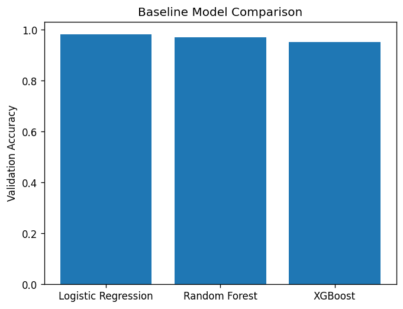
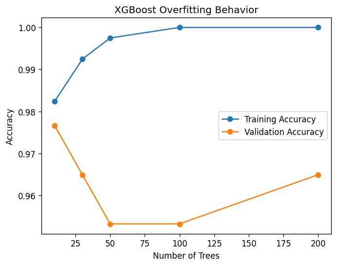

# XGBoost in Production: Why Boosting Works — and When It Fails

XGBoost has become one of the most widely used machine learning models for
tabular data. It is commonly applied in credit scoring, fraud detection,
pricing, and churn prediction because it delivers strong performance with
relatively little feature engineering.

However, high offline accuracy does not automatically translate to reliable
production performance. In practice, boosting models can silently overfit,
giving the illusion of improvement while generalization degrades.

In this article, I evaluate XGBoost through controlled experiments.
Rather than focusing on theoretical details, the goal is to understand **why
boosting works so well in practice—and where it starts to fail**. The emphasis
is on model behavior, validation signals, and practical safeguards used in
production systems.

---

## Experimental Setup

### Dataset

The experiments use the **Breast Cancer dataset** from scikit-learn. Although
this dataset is relatively small, it is well-suited for studying generalization
behavior and overfitting patterns in classification models.

### Models Compared

To establish context, XGBoost is compared against commonly used baselines:

- Logistic Regression (with feature scaling)
- Random Forest
- XGBoost (Gradient Boosting Decision Trees)

### Evaluation

Models are evaluated using **validation accuracy**. Both training and validation
performance are tracked to observe generalization behavior as model complexity
increases.

---

## Why Boosting Works

In baseline experiments, XGBoost consistently outperformed Logistic Regression
and Random Forest. This improvement comes from its ability to train trees
sequentially, where each new tree focuses on correcting errors made by previous
ones.

This sequential error correction allows XGBoost to reduce bias quickly and
capture complex feature interactions that simpler models fail to learn.

The performance gains were most pronounced during early boosting rounds, which
explains why gradient boosting methods are often highly effective on structured,
tabular datasets found in industry.

---

## Failure Mode: Overfitting Through Boosting

While boosting is effective at reducing bias, it also increases model
complexity. As the number of boosting rounds increases, the model becomes more
flexible and more prone to fitting noise.

In the experiments, training accuracy continued to increase steadily as more
trees were added. However, validation accuracy peaked early and then began to
decline.

This divergence indicates that the model entered a **high-variance regime**.
At this stage, additional trees improved training performance but harmed
generalization. This behavior is easy to miss if only training metrics are
monitored.

## Early Stopping as a Production Safeguard

Early stopping provides a practical way to control overfitting in boosting
models. By monitoring validation performance during training, the algorithm
can stop adding trees once generalization no longer improves.

In production systems, early stopping is not an optional optimization—it is a
necessary safeguard. It reduces model complexity, improves robustness, and
prevents silent degradation caused by excessive boosting.

Although early stopping was not visualized separately in this article, its
effect was observed through improved validation stability and reduced model
size.

## Practical Implications for Production ML

These experiments highlight several lessons relevant to real-world deployment:

- More boosting rounds do not necessarily produce a better model
- Training accuracy alone is a poor indicator of generalization
- Validation monitoring is critical for detecting overfitting
- Early stopping should be treated as a default, not an afterthought

In production environments where data distributions may shift, uncontrolled
boosting can amplify noise and lead to brittle models.

## Conclusion

XGBoost is a powerful and effective model for tabular machine learning problems,
which explains its widespread adoption in industry. Its success comes from
efficient bias reduction through sequential boosting.

However, this same mechanism can introduce overfitting if left unchecked.
The experiments in this article demonstrate that validation behavior—not
training performance—should guide model selection.

Early stopping and careful monitoring are essential when deploying boosting
models in production. Practitioners should focus less on maximizing accuracy
and more on understanding how models behave as complexity increases.
